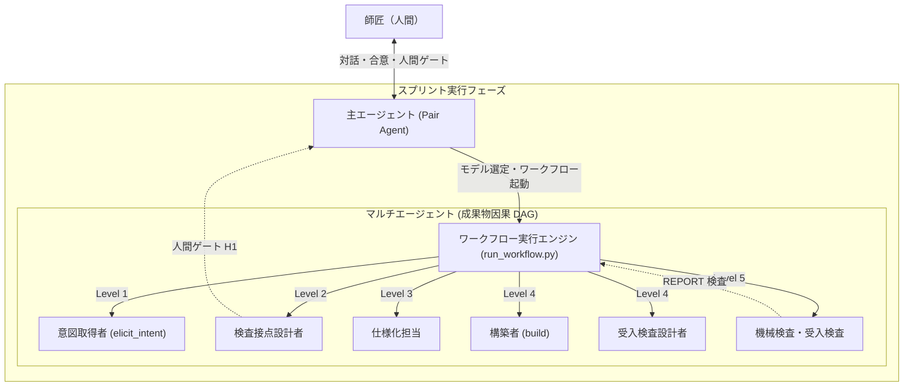

# マルチエージェント・サブエージェント協調ガイド (Claude Code & Gemini / Antigravity)

本ガイドでは、`AgentRoleDesign` の検討成果を取り入れた、**Pair Agent とマルチエージェント／サブエージェントの協調動作**の仕組みと運用方法を解説します。

---

## 1. 全体アーキテクチャ

本システムは、**対話を受け持つ主エージェント**と、**成果物を厳密に生成するサブエージェント**を明確に分離します（P-54 / C-2 原理）。



### 主エージェントとサブエージェントの責務分界

| 項目 | 主エージェント (Pair Agent) | サブエージェント (役割エージェント) |
|---|---|---|
| **相手** | 師匠（人間） | 成果物（ファイル） |
| **責務** | スプリント進行（協議・合意・実行・振り返り） | 単一 target の生成と事後条件の充足 |
| **入力** | 師匠の発話、合意ドキュメント、ペア固有知見 | 宣言された `deps`（必須・任意・前版）のみ |
| **遮断** | なし（全対話・全知見を参照可能） | `blocks` に指定された成果物は**絶対に読まない** |
| **対話規範** | セッション開始手順、逐次確認、質問 | **適用除外**（自律実行し REPORT のみ返却） |
| **出力** | 対話応答、合意文書、振り返り記録 | 成果物（ファイル） ＋ 構造化報告 (REPORT) |

---

## 2. カタログ資産（モデルとスキル）

`models/` にプロセスモデル、`skills/` に 51 件の専門スキルがカタログ化されています。

### プロセスモデル (`models/`)
- **Pair Agent 最適化専用モデル（徒弟制度・スライスサイズ対応）**:
  - `pair-agent-xs.mk`: 最軽量・最速。親が実装、独立受入検査役のみ起動（最安）
  - `pair-agent-s.mk`: バグ修正・小改修用（バグ票が仕様、直線パイプライン）
  - `pair-agent-m.mk`: 標準機能開発スプリント（合意ドキュメント gate H1、並行構築・受入検査）
  - `pair-agent-l.mk`: アーキテクチャ刷新・基盤改修（探針、Tier 1設計、厳格ゲート）
- **汎用ソフトウェア工学モデル**:
  - `waterfall-core.mk`: 標準的な要求・仕様・実装・変異試験・受入検査の因果DAG
  - `waterfall-small.mk`: 小規模変更向けの軽量ウォーターフォール
  - `waterfall-extended.mk`: アーキテクチャ設計・詳細設計を含む拡張モデル
  - `devops.mk`: 運用・デプロイ・計測を含むDevOpsパイプライン
  - `inquiry-small.mk`: 小規模調査・技術検証モデル
  - `meta.mk`: メタ層（プロセスモデル選定・見積もり）

### スキルカタログ (`skills/`)
- 16 領域 / 51 スキル（QAW, ATAM, 同値分割, 境界値分析, ホワイトボックステストの書き方, 縮退経路のログ設計, 判定可能な仕様の書き方, 受入検査の隔離規約 など）。

---

## 3. 生成ツール: `emit_agents.py`

成果物定義（`.mk`）から、Claude Code および Google Antigravity (Gemini) 向けの定義を一括出力します。

```bash
# 全モデル・両基盤（Claude & Gemini）に出力
python tools/emit_agents.py

# 特定モデルのみ Gemini 向けに出力
python tools/emit_agents.py models/waterfall-core.mk --target=gemini

# グローバル環境（~/.claude および ~/.gemini/config）へ配置
python tools/emit_agents.py --dest=global
```

### 生成されるファイル構造
- **Claude Code**:
  - `.claude/agents/<model>-<task>.md`（サブエージェント定義）
  - `.claude/skills/<skill>/SKILL.md`（スキル定義）
  - `.claude/workflows/<model>.js`（台本 JS）
- **Google Antigravity (Gemini)**:
  - `.agents/agents/<model>-<task>.md`（エージェント仕様書）
  - `.agents/skills/<model>-<task>/SKILL.md`（オンデマンド発動スキル）
  - `.agents/skills/<skill>/SKILL.md`（スキルカタログ）
  - `.agents/workflows/<model>.json`（DAG ワークフロー定義 JSON）

---

## 4. 実行エンジン: `run_workflow.py`

成果物 DAG をステップ実行し、ハーネス要件を満たしながらマルチエージェントを駆動します。

```bash
# 実行判定（dry-run）
python tools/run_workflow.py waterfall-core --dry-run

# 作業ディレクトリを指定して実行（人間ゲートで一時停止）
python tools/run_workflow.py waterfall-core --root=.

# 人間ゲートで停止せずに通しで実行
python tools/run_workflow.py waterfall-core --no-stop
```

### 内蔵されるハーネス機能
1. **起動の 2 条件 (P-53)**:
   - 実行可能条件: 必須 dep がすべて存在するか
   - 検出条件: deps のいずれかが target より新しいか
2. **H-8 実装**: 出力内容が前回と同一であれば mtime を巻き戻し、下流の空回りを防ぐ。
3. **人間ゲート (H1... )**: 師匠の承認が必要な箇所で安全に停止し、主エージェントにエスカレーション。
4. **機械検査**: 完了報告 (REPORT) の事後条件未達、遮断（blocks）違反、deps 外読み取りを検査。

---

## 5. スプリントでの実践フロー

1. **協議フェーズ**:
   - 師匠からゴールを受け取る。
   - 主エージェントが「どのプロセスモデル（例: `waterfall-core`）を適用するか」を提案・合意。
2. **合意フェーズ**:
   - 入力（要望・制約）を `inbox/` 配下に配置し、合意ドキュメントを締結。
3. **実行フェーズ**:
   - 主エージェントが `tools/run_workflow.py` または各プラットフォームのマルチエージェント台本を起動。
   - 中間成果物が人間ゲートに達したら、主エージェントが師匠に提示して確認。
   - 最終成果物（受入検査報告書・残留リスク報告）が完成。
4. **振り返りフェーズ**:
   - ビジョン記録と学びを蓄積し、必要に応じてスキルを昇格。

---

## 6. 実走（Mnemo）で出た問題の解決策と実行時遮断フック

実プロジェクト（Mnemo）での先行実走において発生した現場の課題と、その決定的な解決策を取り込んでいます。

### ① 宣言だけでは遮断が破られる問題 → `PreToolUse` フック（`deny_read.py`）
- **課題**: サブエージェントが自律的に Grep や Read を行う中で、`blocks` に指定された成果物を無意識に読んでしまうケースがあった（Windows では frontmatter の hooks: が環境によって起動しない）。
- **解決策**:
  - プロジェクト設定（`.claude/settings.json` または `.agents/hooks.json`）の `PreToolUse` に [tools/deny_read.py](file:///Users/shinichi/work/PairAgenticClaude/tools/deny_read.py) を登録。
  - サブエージェントの `agent_type` を参照し、[deny-map.json](file:///Users/shinichi/work/PairAgenticClaude/.claude/hooks/deny-map.json) から glob を引いて `Read`, `Grep`, `Glob`, `Bash` を実行時に物理遮断（exit 2）。
  - 親セッション（主エージェント）には `agent_type` が無いため無条件に通過（オーバーヘッドなし）。
  - `tools/emit_agents.py` により、`.mk` の `blocks` 宣言から `deny-map.json` が全自動生成される。

### ② Windows 環境での日本語パス例外（fail-open）の防止
- **課題**: Windows の `sys.stdin` は既定で `cp932` のため、日本語のパスやコマンドが含まれると JSON デコードで例外が起き、fail-open して遮断が素通りしていた。
- **解決策**: `sys.stdin.buffer.read().decode("utf-8", errors="replace")` を用いて、バイト列から明示的に UTF-8 でデコード。

### ③ フック遅延の短縮
- PowerShell（1 呼び出し約 1.1 秒）から Python スクリプト（約 0.3 秒）に置き換え、ツール呼び出しのオーバーヘッドを大幅削減。

### ④ 受入検査の隔離ディレクトリ
- 受入検査仕様を合意ドキュメント内に記述すると構築者が読めてしまうため、`.pair-agent/acceptance/` および `.pair-agent/assurance/` に独立分離。

### ⑤ コミットメッセージへの BOM 混入防止
- 同期担当エージェントがコミットする際、UTF-8 BOM (U+FEFF) の混入を禁止する規律を役割定義に明記。

---

## 7. コスト削減の成果（subagent-cost-is-calls-times-context）

Mnemo の実測（`tools/measure_agent_usage.py`）により、**マルチエージェントの費用構造**が解明されました。

### 費用の真因: 「呼び出し回数 × 文脈の大きさ」
- 起動固定費（定義＋CLAUDE.md＋ブリーフ）は 17〜52k トークンに過ぎず、主因ではない。
- サブエージェントが 1 体で長く走り続けると、文脈が 700k トークン以上に肥大化し、後半の 1 呼び出しあたりのトークン費用が跳ね上がる。
- 親のセッション費用は 1/10 に激減するが、子の制御を怠ると子だけで高額な費用が発生する。

### 4 つのコスト削減策（実証済み）:
1. **呼び出し上限 (`maxTurns`) の厳密設定**:
   - 構築者 150、受入検査 120、仕様・設計・探針 80、見積・方針・文書整合 60、起票・観測・解除 50、意図取得 40、同期 25、機械処理 20、非回帰 15。
   - 上限で引き継ぎを返して交代させることで、大型タスクの費用を **4〜6 割削減**。
2. **モデル割り当ての最適化（Claude & Gemini 階層マッピング）**:
   - 費用は「呼び出し回数 × そのときの文脈」で決まるため、難易度・責務に応じた 3 階層モデルを割り当てます。

   | 階層 (Tier) | 責務・タスク難易度 | Claude Code | Gemini / Antigravity (最新) | 該当する役割 |
   | :--- | :--- | :--- | :--- | :--- |
   | **Tier 1 (最上位高度推論)** | アーキテクチャ設計、上流方針策定、差し戻し高次判断 | `opus` / `sonnet` | **`gemini-3.1-pro`** | アーキテクト, PjM, 難関修正 |
   | **Tier 2 (自律エージェント基軸)** | 実装構築、詳細仕様、受入検査設計・実施、探針 | `sonnet` | **`gemini-3.8-flash`** | 構築者, 仕様作成者, 受入検査役, 探針役 |
   | **Tier 3 (定型・機械的実行)** | 非回帰テスト、バグ起票、ドキュメント整合、同期、集約 | `haiku` (max 15 turns) | **`gemini-3.8-flash`** (low reasoning) | 非回帰役, 同期担当, 起票者, 機械集約役 |

3. **機械役（非回帰検査など）に診断させない**:
   - 非回帰担当は「テストを走らせて件数を写すだけ」（15回上限・診断禁止）。
4. **受入検査の 2 周目は不合格項目のみを再実行**:
   - 合格済みの全件を再テストしない。

---

## 8. スライスサイズ（XS / S / M / L）と「おまかせ」

師匠の明示宣言に基づき、タスク規模に応じた最小限の編成で運用します。

| サイズ | 意味 | 走らせるエージェント編成 |
|---|---|---|
| **インライン** | 1 コンテキスト。親自身が役割定義をチェックリストとして適用 | 親のみ |
| **XS** | 親が実装し、受入検査実施者（＋非回帰）だけ別コンテキストで検証 | 受入検査実施者（＋非回帰） |
| **S** | バグ票が仕様。単一機能修正 | 構築者 → 非回帰 → 受入検査実施者 → 同期担当 |
| **M** | 合意ドキュメントを書く標準機能スプリント | 意図取得 → 仕様 → 受入検査設計・構築 → 受入検査 → 同期 |
| **L** | アーキテクチャ、外部依存、基盤が動く大規模スプリント | M ＋ 探針複数 ＋ 詳細設計 ＋ 配布追従検査 |
| **おまかせ** | 細かい確認を省きAI推奨案で自律進行し、判断一覧を事後報告に集約 | どのサイズにも付加可能。親はモデルを下げてよい |

- **動的変更**: 途中で前提崩壊や範囲外が出た場合、「S → M」のようにサイズを引き上げて運用。

---

## 9. 使用量・コスト集計計器 (`measure_agent_usage.py`)

Claude Code の会話記録（JSONL）から、親と子の呼び出し回数・文脈トークン・費用（定価換算）・所要時間を集計します。

```bash
# 全セッションの使用量を集計
python tools/measure_agent_usage.py

# 特定日付以降を集計
python tools/measure_agent_usage.py --since 2026-09-15
```

